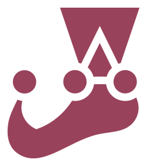

<h1 align="center">Hello 👋, I'm Weslley Santos</h1>

  I am a <strong>brazilian Web Developer</strong>, love animals (I have five cats 😸), <strong>technology</strong> and <strong>learn</strong> new things. In my free time, I love to watch YouTube videos, specially podcasts and everything about technology.

  I love to learn new things and, probably, this is what I'm doing right now. Actualy, I'm studying web development at <a href="https://betrybe.com">Trybe</a> — a brazilian school specialized in this area — in partnership with XP Inc. — the largest investment broker in Brazil.

  <em>
    Ask me anything, I like to talk and help. To reach me, you can use any of these channels: 
  </em>

  
  
  

<h2>Language and tools</h2>

  
  
  
  
  
  
  
  
  
  
  
  
  
  

  <h2>Stats</h2>
  <table align="center">
    <tr>
      <th>
        
      </th>
      <th>
        
      </th>
    </tr>
  </table>
  

    
  

<!---
wes-santos/wes-santos is a ✨ special ✨ repository because its `README.md` (this file) appears on your GitHub profile.
You can click the Preview link to take a look at your changes.
--->
